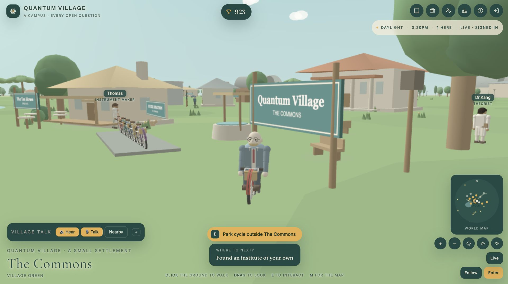
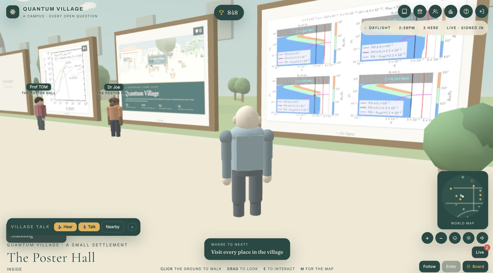
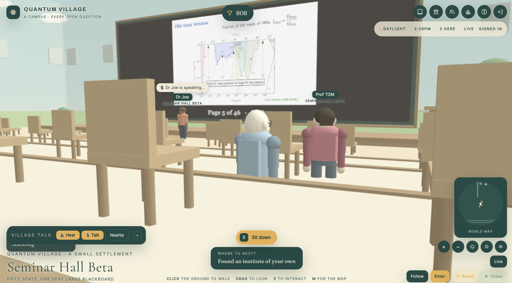
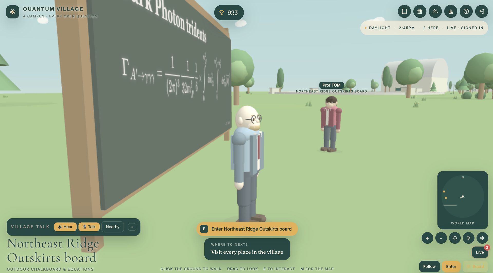
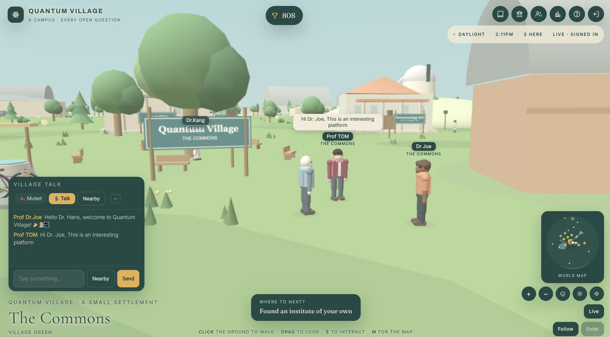
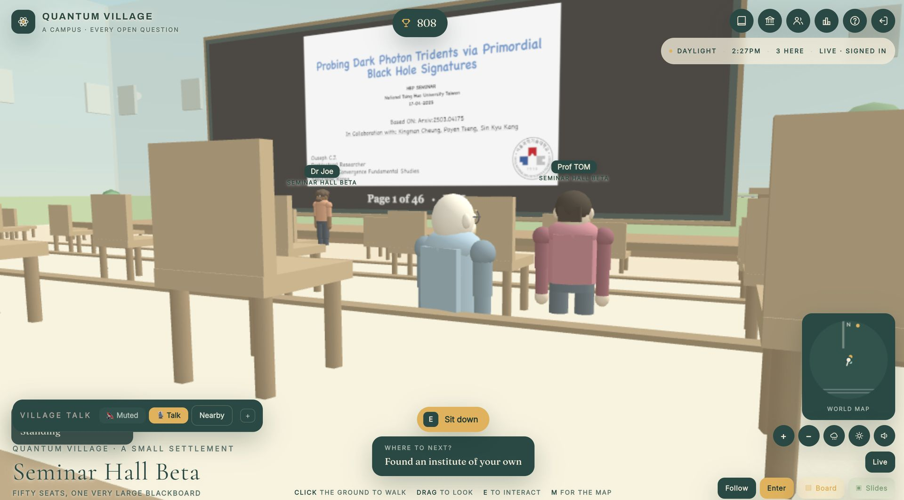
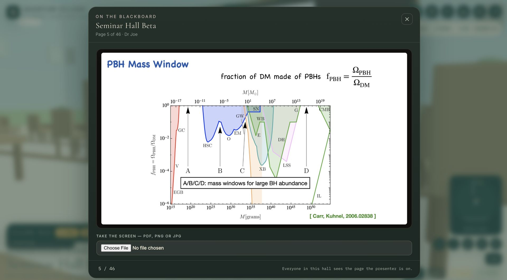

# Quantum Village

A living research campus for theorists, phenomenologists, cosmologists and
anyone else who reads hep-ph over breakfast. Walk between institutes and
laboratories, read real arXiv archives without leaving the page, sit down in
a seminar and take the blackboard, catch a train, and meet whoever else has
the page open.

Plain static files — no build step, no bundler, no npm. Drop it on GitHub
Pages and it works.



*The Commons, on arrival — the sign, the cycle station, whoever else has the page open, and the talk bar along the bottom.*

---

## What is here

```
index.html              the page
css/style.css           the whole look
js/firebase-config.js   ← the only file you normally have to edit
js/papers.js            the arXiv corpus and topic taxonomy (real records)
js/net.js               networking: Firebase, Claude runtime, or solo
js/voice.js             live voice: WebRTC between browsers, nothing stored.
                        Hearing costs nothing and is on from the start;
                        the microphone is a separate switch
js/admin.js             administration: who may block, and what a block is
js/events.js            poster events: registration, numbered stands, admin view
js/activities.js        live activity announcements and the Live panel
js/tour.js              the guided tour a first-time resident is offered
js/board.js             writable blackboards, and the reader B opens
js/engine.js            world primitives — caching, batching, collision,
                        walk-in buildings, interiors
js/village.js           the old village at the centre, sky, weather, people
js/campus.js            the wider campus: roads, rails, districts, buildings
js/transport.js         traffic, buses, trains, aircraft
js/ambient.js           animals, researchers on foot, birds, optional sound
js/interact.js          the "press E" layer
js/rooms.js             seminar and discussion rooms: sitting and speaking
js/slides.js            decks on a seminar hall's blackboard, page by page
js/archives.js          paper icons and the in-page arXiv panel
js/app.js               movement, UI, panels, the research layer
firestore.rules         security rules for the durable data
database.rules.json     security rules for presence, chat and room claims
firebase.json           so `firebase deploy` finds the rule files
functions/              optional: the one job that needs the Admin SDK and
                        therefore cannot live in a browser — disabling and
                        deleting Firebase Authentication accounts
tests/                  voice, voice across browsers, the blackboard
                        reader, slides, and the security rules
.nojekyll               tells GitHub Pages to serve js/ and css/ as-is
```

The only third-party code is three.js (r128, from cdnjs), the Firebase
SDK, which is loaded **only if** a config is present, and MathJax, which is
fetched the first time somebody writes on a blackboard and never before.

---

## The world

Nine hundred metres across, in five quarters joined by roads and pavements:

| quarter | what is there |
|---|---|
| **The Old Village** (centre) | the commons, the Archive, Institute House, Phenomenology Hall, the Tea House, Observatory Knoll, the pond and jetty |
| **North Campus** | the University, two lecture halls, three discussion rooms, the Dirac Library, faculty offices, Café Noether, both poster halls |
| **Research Park** (east) | Institute for Particle Physics, the Detector Hall, Quantum Optics Laboratory, Astrophysics Institute, the storage ring, the telescope dome |
| **Residential & Park** (west) | fourteen houses, the Fellows' Common Room, Café Planck, Noether Park with its pond, fountain and bandstand |
| **Station Quarter** (south) | Quantum Village Central, Westfield Halt, the bus interchange, the open research field |
| **The outskirts** | Seminar Hall α (north-west, past the residences) and Seminar Hall β (south-east, past the research park) — fifty seats each, and the eight outdoor blackboards |

The **Bohr Ring** circles the old village; Curie Way, Feynman Boulevard,
Noether Avenue and Station Road lead off it. Two railway lines run behind the
station. Every building with a door in it can be walked into — the doors
swing open as you reach them, the roof lifts off and the walls turn to glass
while you are inside, and the way in is kept clear: nothing is placed in a
doorway's approach, and no scenery is planted inside a building's footprint.
No two rooms are furnished alike, either: each has its own floor, rug,
lighting, pictures and fittings, chosen from its own name so it looks the
same to everybody. Buildings are identified by the painted sign outside the
door, as they always were.

Residents are built from rounded stock rather than stacked boxes, and choose
their own attire — lab coat, blazer, cardigan, shirt and tie, turtleneck,
hoodie, kurta, t-shirt, academic gown or suit — along with a hairstyle,
glasses, a beard and a satchel.



*A poster hall on North Campus.*

---

## Controls

| | |
|---|---|
| **Click the ground** | walk there |
| **Drag** | look around |
| **Scroll** / **+ −** | zoom |
| **W A S D** / arrows / thumbstick | walk directly |
| **E** | do whatever the prompt says: enter, read, sit, speak |
| **Q** | the second option, when one is offered |
| **M** | world map |
| **J** | everything happening in the village right now |
| **B** | read what is written on the nearest blackboard |
| **V** (hold) | speak, live, to whoever can hear you |
| **Enter** | jump to the chat box |
| round button (phones) | the same as **E** |
| **▤ Board** (right-hand rail) | the same as **B**, for a screen with no keyboard |
| **🔊 Hear** (beside the chat box) | mute or unmute the village. Nothing to do with your microphone |

---

## 1. Put it on GitHub Pages

```bash
git init
git add .
git commit -m "Quantum Village"
git branch -M main
git remote add origin https://github.com/<you>/quantum-village.git
git push -u origin main
```

Then **Settings → Pages → Source: Deploy from a branch → main / (root)**.

A minute later it is live at `https://<you>.github.io/quantum-village/`.
The village is walled, so there is nothing to sign in to until step 2 is
done and the page says so rather than dropping you into an empty world.

---

## 2. Wire up Firebase

`js/firebase-config.js` already holds a web config. Those values are public
by design — every client needs them and they appear in any browser's network
tab. They are **not** secrets; the rules below are what protect the data.
Never put a service-account key anywhere in this repository.

### In the Firebase console

1. **Build → Authentication → Get started.**
   - Enable **Email/Password**. That is the only provider the village
     accepts: both rule files require `auth.provider === 'password'`, so a
     token from anywhere else is refused at the database as well as at the
     front door.
   - **Disable Anonymous and Google.** The village is walled; an anonymous
     pass would be a way round the wall.
2. **Build → Firestore Database → Create database** → production mode.
3. **Build → Realtime Database → Create database** → locked mode.
   Presence, chat and seat claims go here: they change several times a
   second, which is cheap in the Realtime Database and expensive in
   Firestore.
4. Copy the database URL the console shows and check it matches
   `databaseURL` in `js/firebase-config.js`. A database outside us-central1
   is named `...firebasedatabase.app`, not `...firebaseio.com`.
5. **Authentication → Settings → Authorised domains → Add domain** →
   `<you>.github.io`. Sign-in is refused from any domain not on that list,
   and this is the most common reason it silently fails.

### Deploy the rules

```bash
npm install -g firebase-tools
firebase login
firebase use --add            # pick the project
firebase deploy --only firestore:rules,database
```

Or paste `firestore.rules` and `database.rules.json` straight into the
console's Rules tabs.

Both files are JSON-with-comments, which is what Firebase's own parser
expects. `database.rules.json` used to carry its prose as `"//"` **keys**
inside the rules object; Firebase rejects that — `Expected 'rules' property`
— so none of it could be deployed. The comments are now real `/* … */`
comments and the file loads. If your project has been running on whatever
was last pasted into the console, deploy again.

The rules are covered by a test suite. See **Testing** below.

### If you skip step 3

The village notices that there is no Realtime Database and moves presence,
chat and room state onto Firestore by itself. It still works — everyone
shares the same world — but positions update about every two and a half
seconds instead of four times a second, and the status line says
**slow sync**. Creating the database later switches it back with no code
change.

---

## How the data is laid out

**Realtime Database** — things that change constantly.

| path | what it holds |
|---|---|
| `admins/{uid}` | `true`. Readable by anyone signed in, **writable by nobody** from a browser |
| `blocked/{uid}` | `{at, by, byName, why}`. Written only by an administrator; every other rule in the file refuses a uid that appears here |
| `presence/{uid}` | position, facing, name, avatar, room, sitting/speaking; removed on disconnect |
| `chat/{pushId}` | one line of talk, deleted the moment it has been read |
| `chat/{pushId}/seen/{uid}` | read receipts, which is how the author knows to delete it |
| `voiceLive/{uid}` | who is speaking and where — four fields, never any audio |
| `voiceSignal/{to}/{from}/{id}` | one WebRTC offer, answer or candidate; deleted as it is read |
| `activities/{uid}` | what somebody is running: kind, topic, place; removed on disconnect |
| `events/{pushId}` | announcements: an institute founded, a seminar called |
| `rooms/{roomId}/seats/{n}` | `{u: uid, t: when}` — who is in which chair |
| `rooms/{roomId}/speaker` | `{u: uid, t: when}` — who has the blackboard |
| `slides/{roomId}/{uid}` | the one page a seminar hall is looking at: `{s, i, n, by, u, at}`; removed on disconnect |
| `posters/{frame}/{uid}` | a poster: `{s, t, n, at}`; removed on disconnect. A competition poster adds `{competitionId, hallId, expiresAt}` and is kept until `expiresAt` |
| `pins/{posters,boards}/{id}` | `{u, n, at}` — who holds a poster stand or a blackboard. A competition claim adds `{competitionId, expiresAt}` |
| `posterCompetitionRequests/{id}` | a request for a poster competition: `{userId, userName, hallId, title, description?, preferredStart?, requestedAt, status, approvedAt?, expiresAt?, decidedAt?, decidedBy?}` |
| `posterCompetitions/{id}` | an approved competition, same id as its request: `{requestId, hallId, title, organiserId, organiserName, status, approvedAt, expiresAt}` |
| `posterHallCompetition/{hallId}` | `{id, approvedAt, expiresAt}` — the one competition a hall is running |
| `reports/{id}` | a report or feedback: `{reportId, userId, userName, reportType, message, location?, subject?, userAgent?, viewport?, createdAt, status, statusAt?, statusBy?}`. **Readable only by an administrator**, never swept |
| `reportThrottle/{uid}` | server time of the resident's last report; one every thirty seconds |
| `hallBookings/{id}` | a request to book a seminar or poster hall: organiser, institution, position, topic, abstract, hall, event type, `startAt`/`endAt` (plus the date and times as typed, and the organiser's time zone), status. **Private**: readable only by its author and administrators |
| `bookingsByUser/{uid}/{id}` | `true` — how an author finds their own requests |
| `bookingThrottle/{uid}` | server time of the resident's last booking request; one every thirty seconds |
| `hallSlots/{hall}/{ms}` | `{b, t}` — which approved booking holds each quarter hour of a hall |
| `villageNotices/{id}` | the Village Notice Board: approved events only (`b-{booking}` or `c-{competition}`), public to everyone signed in |

**Firestore** — durable things.

| path | what it holds |
|---|---|
| `institutes/{id}` | institutes residents found: name, topic, motto, founder |
| `groups/{id}` | research groups and their member lists |
| `threads/{paperId}` | a paper discussion room; posts carry an expiry and are swept on every write |
| `scores/{uid}` | one score per resident |
| `residents/{uid}` | display name and avatar choices |
| `admins/{uid}` | the same list again, because Firestore rules cannot read the Realtime Database |
| `blocked/{uid}` | and the same blocks, for the same reason |
| `presence`, `chat`, `events`, `rooms` | only used when there is no Realtime Database |

Seats and the speaking slot are claimed with a transaction, so two people
pressing **E** on the same chair cannot both get it, and both are released
automatically on disconnect. A claim older than an hour can be broken, which
is the safety net for a client that died without cleaning up.

### How much this writes

Position is written at most four times a second, and **only when something
changed** — standing still costs a heartbeat every twelve seconds rather
than 240 writes a minute. Ten people walking around is roughly forty small
writes a second, comfortably inside the Spark (free) plan. Traffic, trains
and aircraft are not synchronised at all: they are pure functions of a shared
clock, so everyone sees the same bus without a single write.

---

## Live voice

### Hearing is not speaking

You can hear anybody talking near you from the moment you arrive. There is
no permission to grant — no browser has ever asked before using the
loudspeakers — and **your own microphone has nothing to do with it**.

Each speaker's audio arrives on its own WebRTC connection and is played by
its own `<audio>` element in the page, with `volume` carrying the distance.
Nothing in that path involves the Web Audio API, and that is deliberate:
`createMediaStreamSource()` over a *remote* stream is silent on iOS Safari
and was silent in Chromium unless the page happened to hold a live capture
of its own, and an `AudioContext` is born suspended until a user gesture
resumes it. A listener presses nothing, so the first thing they ever pressed
was the microphone button — which is exactly why hearing the village used to
look like it depended on speaking to it. It does not any more.

The **🔊 Hear** button beside the chat box mutes and unmutes the village and
does nothing else. It never touches your microphone, no other resident's
microphone can touch it, and the choice is remembered. If a browser is still
holding sound back — some will, until the page has been clicked once — the
button turns amber and says **Tap**; clicking it is the gesture that clears
it.

The one thing this costs is stereo placement. Distance attenuation, which is
what tells you whether somebody is beside you or across the lawn, is
unchanged.

### Speaking

Hold **V**, or click the microphone button beside the chat box, and the
village hears you *while you are speaking*. There is no recording step, no
upload and no playback of a file.



*Holding **V** in a hall: the village is told who is speaking, while they are speaking.*

The audio rides a WebRTC connection straight from your browser to each
listener's. The database carries only the handshake:

* `voiceLive/{uid}` — four fields saying you are talking and where you stand,
  armed with `onDisconnect().remove()` and deleted the instant you stop;
* `voiceSignal/{to}/{from}/{id}` — one offer, answer or ICE candidate, which
  the browser that reads it deletes in the same breath.

**No audio is ever written to Firebase**, so there is nothing to clean up
afterwards and nothing that can be recovered later.

Two modes. **Nearby** reaches anyone within seventy metres, attenuated by
distance and recomputed as either of you walks. **Village** reaches everybody
at full volume wherever they are.

Every speaker runs their own set of connections and every listener holds one
element per speaker, so any number of people can talk at once, nobody queues
behind anybody, and one person muting or unmuting changes nothing for anybody
else. `QVVoice.stats()` in the console shows the whole mesh: who you are
hearing, the connection state, whether each element is playing, and at what
volume.

Talking to somebody who is talking back means two separate connections with
the same person, one in each direction. Every handshake note says which of
the two it belongs to — `ice-s` from the speaking end, `ice-l` from the
listening end — and each request to be heard carries a tag of its own, so a
note the database replays after a reconnect is recognised as the repeat it is
rather than being acted on twice.

Connections are peer to peer over public STUN, which is enough on most home
connections. Behind a symmetric NAT — common on office and mobile networks —
the two browsers cannot find a path to each other and the connection fails:
the speaker sees their microphone light, the listener sees "is speaking…",
and nothing is heard. The village says so rather than leaving you guessing.
Fixing it needs a TURN relay, which needs a server of its own; set
`window.QV_ICE_SERVERS` before `js/voice.js` loads (there is a worked example
at the end of `js/firebase-config.js`) and voice works on those networks too.

### Browsers and devices

Voice is opened in whatever is to hand, and browsers disagree about it in
ways worth finding out up front rather than halfway through a seminar.
Everything below is a **feature test** — nothing reads a user agent, so a
browser that grows a capability picks it up by itself, one that loses it
degrades by itself, and a web view pretending to be Safari is judged on what
it can actually do.

| what differs | what the village does about it |
|---|---|
| **iOS ignores `volume`** on a media element: the property takes the write and reads back 1, because loudspeaker level is the switch on the side of the phone | the fade is written and read back, once. Where it does not stick, distance is carried by muting instead — a voice that would have faded below the level of background conversation is silenced rather than played at full volume, so walking away from somebody still means something. `QVVoice.stats().audio.volumeControl` says which you are getting |
| **Safari before 15.4** has no `RTCPeerConnection.connectionState`, so `=== "failed"` is never true and a dead connection says nothing at all | both `connectionState` and `iceConnectionState` are watched. A failure is still noticed, still named, and still waited out before redialling |
| **iOS never fires `beforeunload`** | the microphone is also let go on `pagehide`, so the recording light goes out when somebody leaves |
| **a keyup delivered somewhere else** — switching windows, or a browser shortcut, with **V** held down | losing the window releases push-to-talk. A microphone latched open in a village nobody is standing in is the one thing this must never do |
| **a keyboard that does not spell v with a V** — Cyrillic, Greek, Arabic | the hotkey reads `e.code`, the physical key, and keeps the letter as a fallback |
| **older web views** carrying the callback `getUserMedia` | wrapped to look like the promise one |
| **a device that refuses the constraints** outright rather than ignoring the parts it cannot do | one more try with nothing asked for at all |
| **plain http**, or a browser with no WebRTC | said plainly, before anything is opened. `getUserMedia` is refused without a secure origin everywhere, and telling somebody to "allow it in the address bar" when the real problem is the address is a lie |
| **no microphone, or one another application is holding** | named as what it is, rather than as a permission they can do nothing about |
| **a project with no Realtime Database** | the handshake has nowhere to go, so the microphone button marks itself and stays shut rather than opening a microphone nobody can ever hear. `QVVoice.unavailable()` carries the sentence |

Hearing needs none of it: a media element in the page, one gesture anywhere
to unblock it, and the **🔊 Hear** button for a browser still holding sound
back.

`tests/voice-compat.test.js` stands each of those engines up in turn.

---

## Reading a blackboard

A blackboard is a texture on a wall three metres up. It looks right and it is
unreadable, and zooming the camera into a wall is not reading. So the writing
is kept as text as well as chalk, and there is a way to look at the text.



*An outdoor blackboard on the outskirts. This is the chalk — **B** brings the same writing up at a size made for eyes.*

Press **B**, tap **▤ Board** on the right-hand rail, or click the slate
itself, and what is on that board comes up on screen at a size made for eyes:
the same MathJax pipeline as the chalk, so the equations are the ones on the
board rather than a second opinion about them. While MathJax is still being
fetched the source shows between its dollar signs, so the panel is never
blank and never a lie about what is written.

**B** reaches twenty metres, not the five the chalk does — you read a board
from your chair as often as from in front of it — and when you are inside a
room it opens *that* room's board, so two rooms sharing a wall cannot confuse
it. Click range is capped the same way, because the hover ray only tests
registered objects and nothing occludes them: without it you could click a
blackboard through three walls from the other side of the village.

Anything pinned up beside the chalk gets its own two buttons: **Open the
picture** hands it the whole panel, **Save the picture** downloads it. And if
you are close enough to reach the chalk, **Write on it** takes you straight
into the writing box.

`Esc` closes it. The shortcut is ignored while you are typing in the chat box
or any other field.

---

## Administration

An administrator can bar a resident from the village permanently, and remove
them altogether. Everything below is enforced by the security rules on the
server; the button being hidden is politeness, not the mechanism.

### Making yourself an administrator

There is exactly one way, and it is not in this repository:

* **Realtime Database → Data**, add `admins/<your uid>` = `true`; and
* **Firestore → Data**, add a document `admins/<your uid>` (any contents).

Both rule files make `admins` unwritable from any browser — `".write": false`
and `allow write: if false` — so **nobody can appoint an administrator from
the page**, including an administrator. Your uid is in
**Authentication → Users**.

A shield icon then appears in the top bar. It is drawn from what the database
says, not from anything stored in the browser.

### What a block is

An entry under `blocked/<uid>` in both databases. Every other rule in both
files refuses a request whose `auth.uid` appears there, so a blocked resident
may keep a valid token, may open the page, may edit the JavaScript in their
own browser, and **will not be given one byte of the village nor be allowed
to write one** — no presence, no chat, no voice, not even the WebRTC
handshake. They can read their own block record, so the page can tell them
why, and nothing else.

Their session notices within the second and says so rather than letting the
village quietly freeze.

### Deleting a login

Disabling and deleting a Firebase Authentication account needs the Admin SDK,
and the Admin SDK bypasses every security rule there is — so its credential
must never be in a browser. It lives in `functions/`:

```bash
cd functions
npm install
firebase deploy --only functions
```

Three callables — `blockUser`, `unblockUser`, `deleteUser` — each of which
re-checks the caller against `admins/<uid>` **on the server** before doing
anything. Blocking through them also sets `disabled: true` on the login and
revokes its refresh tokens, so a blocked account cannot even mint a new one.

They deploy to `us-central1` by default; if you pick another region, set
`window.QV_FUNCTIONS_REGION` in `js/firebase-config.js` to match.

**Not deploying them is a supported choice.** Block still bars somebody from
the entire village, and Delete still erases their profile, score and presence
and blocks them for good. The login row in the Authentication tab is all that
survives, and you can delete that by hand.

One consequence of `functions/` existing: a bare `firebase deploy` will now
try to build it. Keep using `firebase deploy --only firestore:rules,database`
unless you mean to deploy the functions too.

### Editing the Notice Board

Each notice under **Administration → Notice Board** has an **Edit** button
for its title, type, venue name, presenter, institution, position and
abstract. The changes appear on the board for everyone at once. The time
and the hall cannot be edited, because the hall was reserved for exactly
that slot. To move an event, cancel it and approve a new booking.

### What is never in the browser

No service-account key, no admin credential, no privileged secret. The values
in `js/firebase-config.js` are the public web config every client needs, and
they protect nothing — the rules do.

---

## Talk is not kept



*Village talk: lines in flight between whoever has the page open, and the same line overhead.*

Village talk is ephemeral by construction, not by a cleanup job:

1. the author pushes the line and arms `onDisconnect().remove()` on it, so a
   closed tab takes it with it;
2. every reader writes `seen/<their uid>` once it is on screen;
3. the author watches that list and deletes the line as soon as everybody who
   was present has read it;
4. a forty-five second timer deletes it regardless, so a reader who wanders
   off mid-sentence cannot pin a message to the database.

There is no history to fetch. On a cold start a client only ever sees what is
still in flight, and the line fades off your own screen after a few minutes
so the log does not pretend to be a record that no longer exists.

The paper discussion rooms work the same way, with a longer window: a post
carries an expiry thirty minutes out, and every write sweeps whatever has
passed it. Whoever opens a room that has gone entirely stale clears it. No
scheduled job, no server.

---

## The seminar halls

Two of them, and deliberately not on the campus: a hall for fifty needs a
footprint no gap between the lecture halls could take, and a seminar that
fills it empties every corridor next to it. So **Seminar Hall α** sits
north-west beyond the residences and **Seminar Hall β** south-east beyond the
research park, each with its own footpath in from the nearest lane and
nothing around it to be quiet for.



*Seminar Hall β — tiers of chairs, every one facing the board, and the board doubling as the screen.*

Inside, one thing decides the room. Forty metres of blackboard, fourteen
metres tall, on the wall opposite the door. Five tiers rising half a metre a
row so nobody reads it past the head in front. Ten chairs a tier, in two
blocks of five with an aisle up the middle, **every one of them facing the
board** — five tens is fifty, which is the number the hall is for.

They are ordinary `seminar` rooms as far as the rest of the village is
concerned: the same seat claims, the same speaking slot, the same activity
notices, the same map pin. `hall: true` in `BUILDINGS` is the only thing that
makes them halls, and all it changes is the layout.

### Slides

The blackboard is also the screen. Stand in a hall and press **P** — or tap
**▣ Slides** in the right-hand rail — and you can put a PDF from your own
machine straight up on the slate at full size. **Next** and **Previous** turn
the page, and the moment you turn one, everybody else in the hall is looking
at the same page, on their board and in their own panel.



*The same page, in a resident's own panel.*

Multi-page decks are the point. The arrow keys turn pages while the panel is
open, a swipe turns them on a phone, and closing the panel leaves a small
page-turner in the rail so a presenter can walk about the hall and still
change slide.

**The PDF never leaves the presenter's browser.** Cloud Storage has needed a
billing account since February 2026 and this project is on the free plan, so
there is nowhere to upload a forty-page deck to — and no reason to want one,
because at any instant a hall is looking at exactly one page. PDF.js opens
the file locally, the current page is rendered and re-encoded as a JPEG, and
that single page is what goes on the wire under `slides/{roomId}/{uid}`.
Turning to page seven sends page seven, not the deck.

The record carries the same `onDisconnect` hook as the chalk, so a presenter
who closes the tab takes their deck down with them rather than leaving a hall
staring at page four for ever. Somebody else putting a deck up takes the
screen — newest write wins, exactly as the boards already work — and the
previous presenter is told and stands down rather than the two of them
fighting over the page number.

`js/slides.js` owns the deck and the page turns; `QVBoard.setSlide` is all
that `js/board.js` knows about it, and `api.onChange` is the single seam to
the network. With no network it all still works, for one person, in one
browser.

---

## Live activities

Take a blackboard, stand up to speak in a seminar hall, put a deck up on its
board, or pin a poster, and the village is told what you are doing and where
— *"Blackboard discussion on Dark Photons — Seminar Hall Alpha"*. The notice slides in under the top bar
with a button that walks you there.


*The notice slides in under the top bar; **Take me there** walks you to it.*

**Live** on the right-hand rail (or **J**) lists everything running right now.
The painted activity board that used to stand in the Commons has been taken
down: something meant to reach everybody the moment it starts is in the wrong
place if you have to walk to the middle of the village to read it.

Each activity is one record under its organiser's uid with an `onDisconnect`
hook, so an activity ends when its organiser leaves whether or not they
remember to end it.

---

## Poster competitions

A poster hall normally works the way it always has: pin a poster and it is
yours for the session, and it comes down when you leave. A hall can also run
a **poster competition** for 24 hours, on top of that.

Walk into either poster hall and the room badge (bottom left) says which mode
it is in:

| mode | what the badge shows |
|---|---|
| Normal | *Normal Presentation Mode* · **Upload Poster** · **Request Poster Competition** |
| Pending | *Competition Request Pending* — waiting for admin approval (the requester can withdraw it) |
| Competition | *🏆 Poster Presentation Competition*, its name, the time remaining, **Upload Competition Poster** |

**Asking.** *Request Poster Competition* takes a title, an optional
description and an optional preferred start. The request is stored as
`pending` under the requester's own uid; the rules refuse any other status,
and refuse `approvedAt` and `expiresAt` from anybody but the approval path.

**Approving.** An administrator sees waiting requests at the top of the
Administration panel (the shield in the rail carries a gold dot while any are
waiting). **Approve** is one atomic write: it marks the request approved,
creates `posterCompetitions/{id}` copied field for field from the request,
and takes `posterHallCompetition/{hall}` — all stamped with
`ServerValue.TIMESTAMP`, which the rules check against `now`. The rules
refuse it if the hall already has an unexpired competition. `expiresAt` is
written straight after and is only ever accepted as exactly
`approvedAt + 24 h`, so nobody can stretch it. **Reject** creates nothing.

**During the competition** every poster pinned in that hall is a competition
poster. Its stand is claimed without a disconnect hook, and the poster is
written with `competitionId`, `hallId` and `expiresAt`, which the rules check
against the competition, the hall and the claim. It stays up after its author
signs out, closes the tab or loses the network, and survives a page refresh.
A new ordinary poster cannot go up in that hall while it runs, and an ordinary
poster cannot be turned into a competition poster by editing the database.

**The end** is `approvedAt + 24 h` by the database's clock:

* every browser hides competition posters the moment `expiresAt` passes (the
  page estimates the server clock from `.info/serverTimeOffset`), and a hall
  full of people switches back to normal mode by itself;
* the rules refuse anything more under that competition from then on, and
  let **anybody** sweep what is left: the posters, the stand claims, the hall
  and the competition's status (`active` → `expired`). The next visitor to
  a poster hall does that tidying;
* `expirePosterCompetitions` in `functions/` does the same every five minutes
  if it is deployed (a scheduled function, so the Blaze plan), which clears
  everything even if nobody visits. It is optional — without it nothing
  expired is ever shown, it is just deleted later.

**Ending early.** A competition also ends before its 24 hours are up if:

* its organiser takes down their competition poster and no competition
  posters are left in it. It ends by itself, so the timer never counts down
  over an empty hall;
* its organiser presses **End competition** on the hall card;
* an administrator presses **End now** under Administration → Competitions,
  or deletes its notice from the Notice Board.

Ending marks it `expired` (with `endedAt`/`endedBy`), releases the hall and moves
its notice to Past in one write. From then on every browser hides its
posters, and the rules let anybody sweep its posters and stands.

Deploy `database.rules.json` before using this: the older rules have none of
these branches and the page will say the request was refused.

---

## Booking a hall, and the Village Notice Board

The four halls that can be booked are Seminar Hall Alpha and Beta, The Poster
Hall and The Grand Poster Hall. Stand in any of them and the hall card (top
left) shows what is on there now and next, with **Book This Hall**. The
Notice Board also has a **Book a hall** button. The form asks for the
organiser's name, institution and position, the event type (seminar, poster
presentation, workshop, conference, research discussion, journal club,
other), the topic, a short abstract, the date and the start and end times
(quarter hours, up to twelve hours), and anything else the administrators
should know. It shows which times that hall is already booked that day.

A request is `pending` and private, and is **not** an event. An administrator
sees it under **Administration → Bookings** with everything the organiser
wrote, any approved booking it clashes with, and any other request that wants
part of the same time. They then:

* **Approve.** One atomic write marks the booking approved (stamped with the
  server's clock), takes every quarter hour it covers in `hallSlots/`, and
  puts the event on the Notice Board. The rules refuse the whole write if any
  of those quarter hours is already held, so **two overlapping bookings can
  never both be approved**, even if two administrators click at the same
  moment. Requests themselves may overlap; approvals may not.
* **Reject.** Nothing else is created.
* **Cancel an approved event.** Its notice says *Cancelled*, and its quarter
  hours are free again.

The organiser is told when their request is decided. Their own requests,
with their status, are under **Notices → My requests**, where a pending one
can be withdrawn.

**The Village Notice Board** (the **Notices** button in the side rail; the
badge is how many events are on in the coming week) shows approved events
only. Each notice has the presenter, institution, position, topic, abstract,
date, time and hall, and opens to the full event with **Take me to** the
hall. It can be filtered by Upcoming / Today / This Week / Past and by
seminars, poster presentations, poster competitions, workshops, research
discussions and other. Times are stored as absolute instants, so everybody
sees an event in their own time zone. The organiser's own date and time are
kept too. A new notice is announced to everyone in the village.

An event moves from Upcoming to Past when it ends, judged by the server's
clock. Whoever is online at the time archives it (the rules let anybody move
an ended event from `active` to `archived` and change nothing else), and so
does `expirePosterCompetitions` if `functions/` is deployed.

**Poster competitions** join in: the request now asks for the organiser's
name, institution and position, and approving one puts it on the Notice
Board in the same write, running from approval for exactly 24 hours. The 24-hour poster
persistence is unchanged. A competition does not reserve quarter hours in
`hallSlots/`, so a poster hall can hold a competition and a booked poster
session at the same time.

**Who may do what** (all enforced by `database.rules.json`, and all tested):
residents may request, in their own name, for the future, and withdraw
while pending. They cannot read anybody else's request, approve or reject,
put anything on the Notice Board, take a slot, or change a booking once it
is sent: not its hall, date, time or status. Only an administrator approves,
rejects, cancels, takes an event off the board or puts it back. Nobody, the
administrator included, can move a notice's time once it is up.

An administrator can also **Delete** any notice, or **Clear the whole
board** (confirmed twice, the second time by typing CLEAR). Deleting a notice
for a booking that has not happened yet cancels the booking and frees the
hall. Deleting a running competition's notice ends the competition. So a
wipe never leaves a hall silently reserved or a competition running with
nothing on the board.

**Administration** is one panel with a tab for each system: Reports,
Bookings, Competitions (pending / approved / rejected), Notice Board
(happening now / upcoming / archived / cancelled) and Residents. The shield
carries a gold dot whenever something is waiting.

---

## Poster events: registration and numbered stands

An administrator announces a poster session under **Administration → Poster
events → New poster event**. The form takes a title, a description, the
start and end, an optional registration deadline, and the capacity of each
hall. It also has two switches: accept competition entries, and require an
administrator to approve each registration. Poster Hall 1 (the Poster Hall)
has 12 stands and Poster Hall 2 (the Grand Poster Hall) has 50. A capacity
of 0 leaves that hall out.

The session appears at the top of the **Notice Board**. Each card shows the
registration status, the free stands in each hall, and the deadline. The
event page adds a colour-coded map of every stand (available, registered,
awaiting approval, poster uploaded, competition entry) and a searchable
list of participants by hall and poster number.

**Registering.** A resident presses **Register** and fills in their name,
institution, position, affiliation, poster title and abstract. They tick
*Participate in Poster Presentation*, and optionally *Enter Poster
Presentation Competition*. They get the lowest free poster number in the
hall they choose (or whichever hall has room), and are told it straight
away. Each hall numbers its stands on its own, from 1. The number is shown
on a plate under each stand, together with what is on it.

**Uploading.** From the event page, **Upload my poster** opens the usual
pin sheet for the resident's own stand. They can also walk up to the stand
and press E. The poster stays up after they leave, until they or an
administrator take it down. Nobody else can pin to a registered stand.
Stands outside the event work as they always did.

**Likes.** ♡ Like on any poster (or L at the stand). Pressing it again
takes the like back. Each resident has at most one like per poster, and
the count updates live for everyone. A registered poster's likes follow
the registration, not the stand.

**Administration.** Each event has these controls:
- **Participants:** statistics, the stand map, and filters for awaiting
  approval, competition, uploaded, Hall 1, Hall 2 and rejected.
- **Per registration:** Approve, Reject, Move to the other hall (which
  takes the next free number there), View or Remove the poster, and Remove
  the registration.
- **Per event:** Edit, open or close registration, and Delete.

### Requesting a poster event (residents)

Only an administrator can create a poster event: the rules refuse
`posterEvents/` writes from anyone else. A resident can ask for one from
the Notice Board. **Request a poster event** opens a form with these fields:
- name, institution or organisation, email, and position or role
- event title, topic, description, and start and end times
- an optional registration deadline
- the venue: Poster Hall 1, Poster Hall 2, both halls, a virtual location
  or another location, with details
- expected posters, and whether to include a competition
- a short abstract, the organiser responsibilities (the organiser must tick
  a box agreeing to them), additional information, and other event details

When the form is sent, the page makes a **PDF of the request** with jsPDF,
loaded from cdnjs the first time it is needed. The PDF is stored beside the
request. Both are private: only the requester and the administrators can
read them. Nothing is published yet.

**Administration → Poster events** lists the requests with Pending,
Approved, Rejected and All filters. The tab's badge counts pending
requests, and an administrator gets a notification when a new one arrives.
Each request shows every field. The administrator can:
- **Download PDF**
- **Approve…**, which opens the event form filled in from the request.
  Adjust the halls, capacity and dates, optionally add a note, then press
  **Approve and publish**.
- **Reject**, with an optional reason that the organiser sees
- **Delete** the request together with its PDF

Approving writes the event and marks the request approved in one update.
The rules refuse an approval that doesn't create its event, so a request
reaches the Notice Board only when it is approved. The requester follows
it under **Notice Board → My requests**. From there they can see its
status, download the PDF, withdraw it while it is still pending, or open
the published event. They are also notified when it is decided. An
administrator sees **New poster event** on the Notice Board instead, which
goes straight to the admin form.

jsPDF's built-in fonts cover Western European text. Greek letters in a
title are spelled out in the PDF (α becomes "alpha"). The stored request
keeps every character exactly as it was typed.

### Why two residents can never share a stand

```
posterEvents/<event>                  the event (administrators only)
posterRegs/<event>/<uid>              one registration per resident: hallId, num
posterSlots/<event>/<hall>/<num>      = uid
posterRegPosters/<event>/<uid>        the uploaded poster
```

A registration and its slot are written in one update. `database.rules.json`
accepts it only if the slot was empty, the registration and slot name each
other, the number is within the hall's capacity, registration is open and
before its deadline, and the status is `registered` (or `pending` when
approval is on). If two residents race for the same number, the second
write is refused and the page takes the next number. A registration is
keyed by uid, so registering twice cannot take a second stand. Cancelling
must free the slot in the same write, so nobody else's number ever
changes. A resident can edit only their own wording. The number, the hall
and the status belong to an administrator.

`tests/rules/rules.test.mjs` covers all of this against the emulator:
capacity, duplicates, the race, cancelling, moving, deadlines, blocked
accounts and likes.

## Reports and feedback

The **flag** in the top bar opens **Report / Feedback** from anywhere in the
village, over the top of whatever you are doing. Pick a type (abuse,
inappropriate content, technical problem, bug, voice chat, text chat, login,
display/UI, other), write as much as you need, and check the location, which
is filled in from the room or place you are in. Every poster also has a
**Report** button when you open it, which fills in which poster and who
pinned it.

A report goes to `reports/{id}` in the Realtime Database, stamped with
`ServerValue.TIMESTAMP`. It is a record, not talk: nothing deletes it after it
is read, and it stays until an administrator deletes it. The rules:

* only a signed-in, unblocked resident may file one, only in their own name,
  and only as `new`;
* the message is kept **exactly as written**, up to 5000 characters. A longer
  one is refused with a message, never quietly cut. Control characters are
  stripped before sending, and administrators only ever see it as text;
* one report every thirty seconds per resident, enforced by
  `reportThrottle/{uid}`, which is stamped in the same write and cannot be
  deleted by its owner;
* **nobody but an administrator can read reports**, including the author's own. Only
  an administrator can change the status (`new`, `reviewing`, `resolved`,
  `dismissed`) or delete a report. Nobody can edit what was reported, including an administrator.

Administrators review them under **Administration → Reports**, filtered by
status, with the full message, the reporter's name and uid, the location, the
time, and the browser and screen size it was sent from. The shield in the
rail carries a gold dot while any are new.

Screenshots are not attached: the village has no file storage (Cloud Storage
needs a paid plan), and a picture in the database would be the one thing
there that anybody could make large.

---

## The arrival tour

A first-time resident is offered a ten-stop tour — the Commons, the Archive,
the Refectory, the Lecture Barn, the library, both poster halls, a seminar
hall, the research park, the west quarter and the station. It can be skipped,
and taken again later from **How the village works → Take the village tour**.

---

## Performance

The village has to run on a laptop on battery and a phone in a pocket, so:

* **Adaptive resolution.** Frame time is measured continuously and the pixel
  ratio moves to fit, in coarse steps with a long cooldown. Antialiasing is
  refused on small and touch panels, where the pixels are too small to show
  what it removes.
* **A frame budget.** Rendering is capped at 60 fps. On a 120 Hz panel that
  halves the GPU work for a village that does not move fast enough to show
  the difference.
* **Nothing is drawn in a background tab.** A hidden canvas otherwise costs a
  full frame of work.
* **Three tiers of work per frame.** Movement, the world and where the name
  tags sit run every frame. Which tags exist, the place card, the HUD and the
  presence write run at 10 Hz. The minimap redraws at 4 Hz.
* **Content LOD.** Each building's furniture lives in one group that is
  switched off past the distance at which it stops being legible, and door
  leaves are hidden past 130 m.
* **A tighter far plane.** The sky, stars and clouds travel with the camera,
  so the far plane only has to cover the fog instead of two kilometres of
  scenery the fog had already hidden.
* **Instancing.** Meadow, grass, wildflowers, trees, fences, chairs and
  tables all go through one batch and come out as a handful of draw calls.
* **Name tags rewrite their markup only when the text changes**, rather than
  rebuilding sixteen DOM subtrees sixty times a second.

---

## About the papers

Every record in the Archive is a **real arXiv entry**. Titles and identifiers
were gathered on 2026-09-13; abstract, PDF and search links are derived from
the identifier in code, so no URL is ever typed by hand and no citation is
invented.

The paper stands scattered through the library, the offices and the
laboratories each open an **arXiv archive** in a panel over the game. The
panel has two sides: a *reading room* drawn from the village's own index,
which always works, and the live *arXiv listing* in a frame. arXiv sends
`X-Frame-Options`, so many browsers will refuse to render it; the panel
detects that and says so plainly instead of showing a blank rectangle.

To add an archive, add a row to `ARCHIVES` in `js/archives.js`. Placement is
automatic.

To refresh the paper feed, regenerate `js/papers.js`. Its format is
deliberately plain:

```js
{ t:"dp", i:"2603.08430", n:"The Dark Photon: a 2026 Perspective" }
//  topic    arXiv id       title
```

---

## Extending it

Everything the world is made of is a table:

| to add | edit |
|---|---|
| a building or a room | `BUILDINGS` in `js/campus.js` — one row, walls, doors and furniture follow |
| a road | `ROADS` in `js/campus.js`; traffic picks it up automatically |
| a train service | `STATIONS` and the timetable in `js/transport.js` |
| a flight path | `FLIGHT_PATHS` in `js/transport.js` |
| an archive | `ARCHIVES` in `js/archives.js` |
| animals | `HERDS` in `js/ambient.js` |
| papers | `js/papers.js` |

A building's `kind` decides what goes inside it and what pressing **E**
does — `seminar`, `discussion`, `lecture`, `library`, `lab`, `cafe`,
`institute`, `offices`, `station`, `common`.

---

## Performance

The world is about three thousand static meshes plus a few dozen
`InstancedMesh` batches holding eight thousand trees, fences, chairs, books
and street lamps. Everything shares a dozen unit geometries and one material
per colour. Collision runs through a uniform grid rather than a linear scan,
animals and researchers tick at 12 Hz and only within sight, and distant
objects are skipped entirely. Building the whole world takes about a fifth
of a second.

---

## Testing

Five suites live in `tests/`, and the important ones need nothing but Node:

```bash
node tests/voice.test.js .        # three residents, one microphone, no browser
node tests/voice-compat.test.js . # the same voice in browsers that are not this one
node tests/board.test.js .        # the blackboard reader
node tests/slides.test.js .       # a deck on a seminar hall's board
```

`voice-compat.test.js` is the cross-browser one: iOS's volume property,
Safari's missing `connectionState`, the callback `getUserMedia`, a page on
plain http, a project with no Realtime Database, a keyboard that does not
spell v with a V, and a **V** held down while somebody switches windows.

`voice.test.js` is the multi-user voice test that otherwise needs three
machines: three JavaScript contexts, a fake WebRTC stack and a fake
signalling database, asserting that B and C hear A **without ever touching a
microphone**, that two people talking at once do not silence each other, that
muting is local, and that nothing but handshake notes ever reaches the
database.

The security rules have their own suite against the Firebase emulators,
running the real rule files. It needs a JDK 21 or newer:

```bash
cd tests/rules
npm install --no-save @firebase/rules-unit-testing firebase firebase-tools
npx firebase emulators:exec --only database,firestore --project qv-rules-test \
    "node rules.test.mjs"
```

See `tests/README.md` for what each one covers, and for what they do not:
a real microphone, a real NAT and a real phone in the hand still want a human.

---

## Licence

Yours to do as you like with. three.js is MIT; the Firebase SDK is Apache 2.0.
